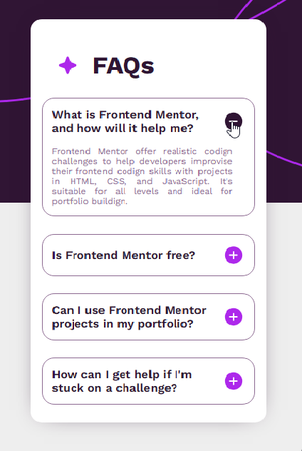

# Project FAQ accordion 🚀

## Description:
- This project shows the display of Frequently Asked Questions (FAQs) on a web page, for this project we used a development environment such as VITE to start the application, this is a challenge from the (https://www.frontendmentor.io/) [FrontendMentor] page, which provides similar projects like this or higher.

## Tecnologias:

## Responsive Design (mobile & tablet):

## Deploy to GITHUB-PAGES from the terminal:
> [! USE]
> If you want to deploy your app on the GitHub Pages website, follow these steps:
- install dependendecia, `npm install gh-pages --save-dev`
- Place a script pointing to the production folder in the package.json, `"deploy": "gh-pages -d dist"`
- In the Vite configuration indicate the base repository, `base : /name_repository`

## Author: 
[Juan Ramirez] (https://www.linkedin.com/in/juan-ramirez-490b84271/) [Linkedin]

<!-- 
[!NOTE]: Una nota general que proporciona información o contexto.
[!IMPORTANT]: Una nota importante que debe leerse cuidadosamente.
[!USE]: Una nota que proporciona instrucciones sobre cómo usar algo.
[!BUG]: Una nota que informa sobre un error o problema.
[!TODO]: Una nota que indica una tarea pendiente.
También hay otros tipos de notas menos comunes, como:

[!HACK]: Una nota que proporciona un truco o solución alternativa.
[!WARNING]: Una nota que advierte sobre un peligro o riesgo.
[!DEPRECATED]: Una nota que informa sobre una característica o funcionalidad que ya no se usa.
[!SECURITY]: Una nota que informa sobre una vulnerabilidad de seguridad. -->