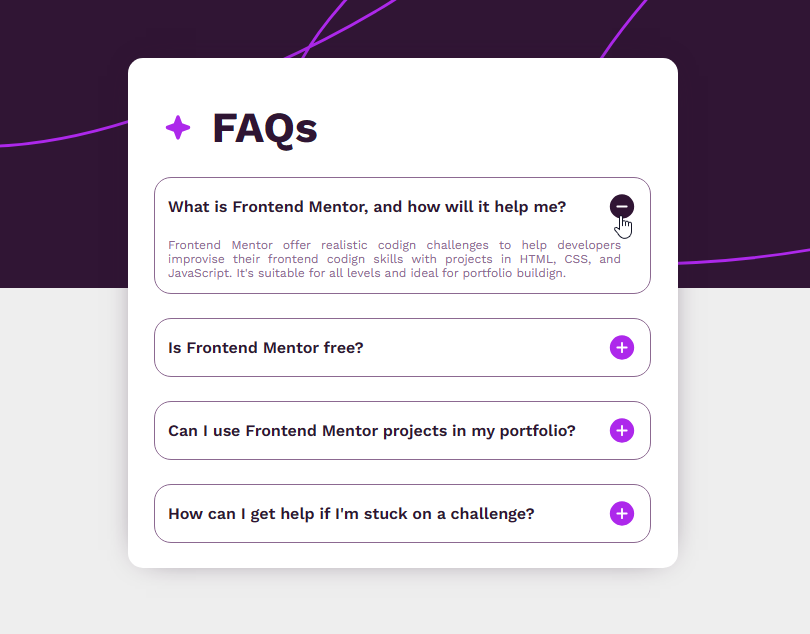

# Project FAQ accordion 🚀

## Description:
- 

## Responsive Design (mobile & tablet):

<!-- 
[!NOTE]: Una nota general que proporciona información o contexto.
[!IMPORTANT]: Una nota importante que debe leerse cuidadosamente.
[!USE]: Una nota que proporciona instrucciones sobre cómo usar algo.
[!BUG]: Una nota que informa sobre un error o problema.
[!TODO]: Una nota que indica una tarea pendiente.
También hay otros tipos de notas menos comunes, como:

[!HACK]: Una nota que proporciona un truco o solución alternativa.
[!WARNING]: Una nota que advierte sobre un peligro o riesgo.
[!DEPRECATED]: Una nota que informa sobre una característica o funcionalidad que ya no se usa.
[!SECURITY]: Una nota que informa sobre una vulnerabilidad de seguridad. -->